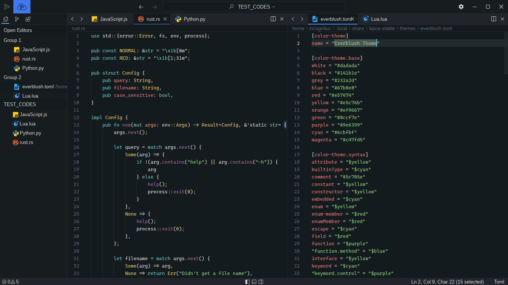

<div align="center">
 
</div> 

<h1 align="center">Everblush Lapce Theme</h1> 
<h4 align="center"><i>Lapce Editor in Everblush</i></h4> 

<p align="center"> 
 


</p>

# Preview 
<p align="center"> 
 
</p>

# Installation
- Add everblush.toml to ```$HOME/.local/share/lapce-stable/themes/```.

### OR 
- You can navigate to `Plugins >> Search Everblush`
- And Install it.
